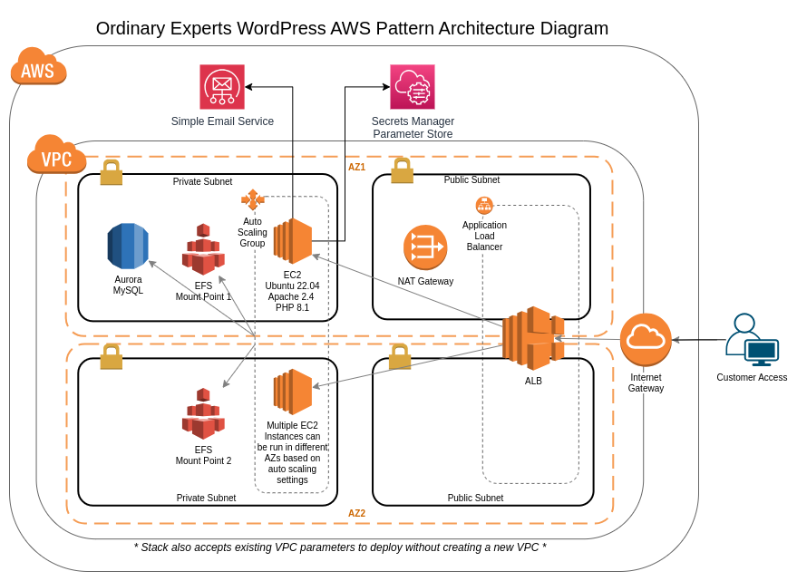

# WordPress on AWS Pattern

The Ordinary Experts WordPress Pattern is an open-source AWS CloudFormation template + custom AMI that offers an easy-to-install AWS infrastructure solution for quickly deploying a WordPress site.

* [WordPress](https://wordpress.org/) is open source software you can use to create a beautiful website, blog, or app.

## Product Setup

For this pattern to work, you must first:

1. Have an AWS Route 53 Hosted Zone configured in your account
1. Have an AWS Certificate Manager certificate provisioned for the desired hostname

After that you can just launch the CloudFormation stack and fill out the required parameters.

## Technical Details

* Ubuntu 22.04
* Apache 2.4
* PHP 8.1

The AWS stack uses Amazon Elastic Compute Cloud (Amazon EC2), Amazon Virtual Public Cloud (Amazon VPC), Amazon Aurora, Amazon Elastic File System (Amazon EFS), Amazon Simple Email Service (Amazon SES), AWS Systems Manager, and Amazon Secrets Manager.

Automatically configured to support auto-scaling through AWS Autoscaling Groups, this solution leverages an EFS file system to share user generated content between application servers.

Direct access to the EC2 instance for maintenance and customizations is possible through AWS Systems Manager Agent which is running as a service on the instance. For access, locate the EC2 instance in the AWS console dashboard, select it and click the "Connect" button, selecting the "Session Manager" option.

### wp-config.php Customization

In order to add custom values to the wp-config.php file, create an SSM Parameter of type Secure String. Enter the value of the PHP code to be inserted into wp-config.php into the value of the SSM Parameter. Then include the ARN of the SSM Parameter as the `CustomWpConfigParameterArn` CloudFormation parameter.

In order for changes in the SSM Parameter value to be deployed to the WordPress site, update the `AsgReprovisionString` value to any different value (for example, today's date), and update the CloudFormation stack. This will cause the EC2 instance to be reprovisioned, which will fetch the latest configuration from the specified SSM Parameter.

### SFTP Access

In order to transfer files between a local workstation and the EC2 instance, similar to an SFTP experience, the AWS Systems Manager can be used to forward the SFTP traffic from the EC2 instance to a local computer.

For this to work, the stack must be configured to use the AsgKeyName parameter to specify an AWS Key Pair that can be used when connecting to the instance.

To do so, first find the instance id from the AWS console for the WordPress server.

Then, from the computer that should connect to the instance, run the following:

```
aws ssm start-session \
  --target i-xxxxxxxxxxxxxxxx \
  --document-name AWS-StartPortForwardingSession \
  --parameters '{"portNumber":["22"],"localPortNumber":["2222"]}'
```

Replace 'i-xxxxxxxxxxxxxxxx' with the instance id from the console.

Then, configure an SFTP client with:

* Protocol: SFTP
* Hostname: 127.0.0.1
* Port: 2222
* Username: ubuntu
* Auth Method: Public Key - select the PEM file from the Key Pair indicated in the AsgKeyName parameter

## Stack Infrastructure



## Developer Setup

We are following the [3 Musketeers](https://3musketeers.io/) pattern for project layout / setup.

First, install [Docker](https://www.docker.com/), [Docker Compose](https://docs.docker.com/compose/), and [Make](https://www.gnu.org/software/make/).

Then run `make update-common` to fetch the shared Make commands. Inspect the `Makefile` and `common.mk` files to see additional commands.

## Feedback

To post feedback, submit feature ideas, or report bugs, use the [Issues section](https://github.com/ordinaryexperts/aws-marketplace-oe-patterns-wordpress/issues) of this GitHub repo.
